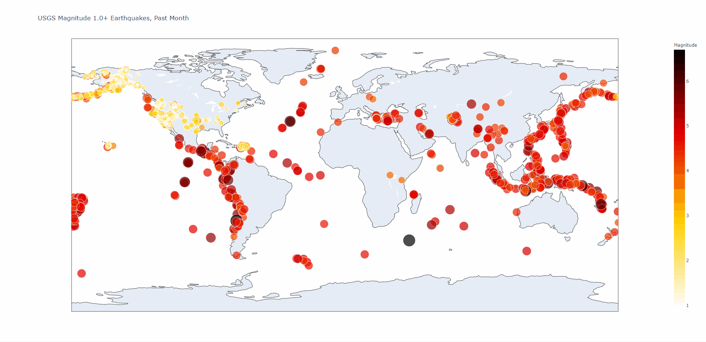
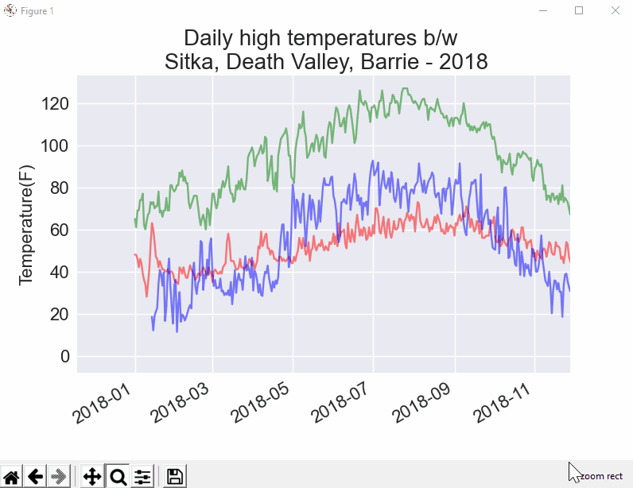

# Data-Visualizations
Data Analysis using Python3 packages
1. Matplotlib- to create static, animated, and interactive visualizations in Python.
2. Plotly- to create interactive visualizations.
3. NumPy- to work with complex data retrieved from API.
4. Pandas- to work with raw data.

Made visualizations of real-time JSON and CSV data retrieved using the help of APIs. Some of the scenarios are listed below-

**1. Random walk of a drunk person taking n steps, which helps in data analyisis and predicting weather and earthquakes.

**2. Realtime earthquakes occured in past month on Richter magnitude scale plotted on world map.**

**3. Probability of throwing dices in various situations n times and plotting them on the graph.**

**4. Realtime weather difference between two or more different cities or regions and plotting them on the graph. Data retrieved from Weather API's.**

**5. The scale of Global fires around the world in a given period of time. Data retrieved from NASA Global fires API.**

## License

- App: MIT
